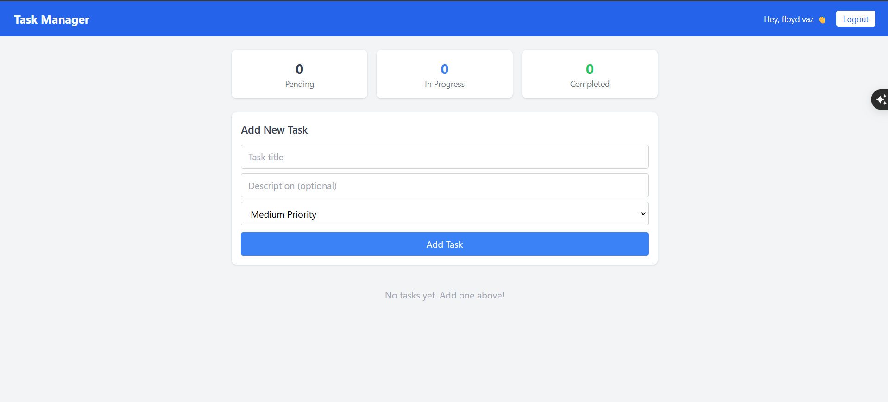
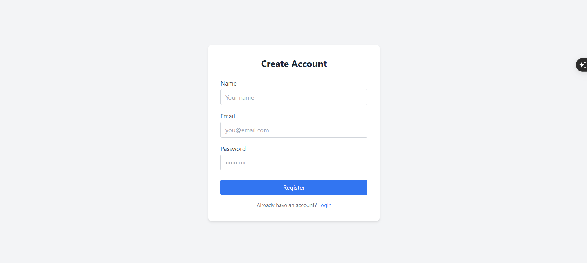
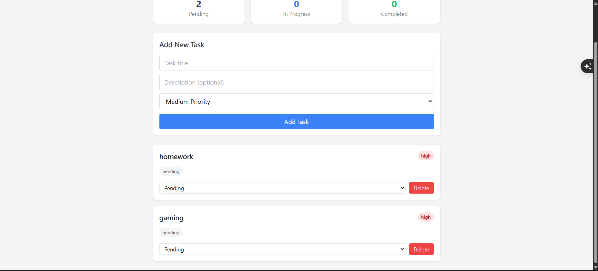

# Task Manager App

A full-stack task management application built with the MERN stack.

## Features
- User authentication (Register/Login) with JWT
- Create, update, and delete tasks
- Set task priority (Low, Medium, High)
- Track task status (Pending, In Progress, Completed)
- Dashboard with task statistics
- Fully responsive UI

## Tech Stack
**Frontend:** React.js, Tailwind CSS, Axios, React Router
**Backend:** Node.js, Express.js
**Database:** MongoDB Atlas
**Auth:** JWT, bcryptjs

## Getting Started

### Prerequisites
- Node.js installed
- MongoDB Atlas account

### Installation

1. Clone the repo
   git clone https://github.com/floyd-vaz/task-manager-app.git

2. Setup Backend
   cd backend
   npm install
   Create a .env file with:
   MONGO_URI=your_mongodb_uri
   JWT_SECRET=your_secret
   PORT=5000
   npm run dev

3. Setup Frontend
   cd frontend
   npm install
   npm run dev

4. Open http://localhost:5173 in your browser

## Screenshots

## Live Demo
Frontend: https://task-manager-app-fpc2.vercel.app
Backend: https://your-backend.onrender.com
